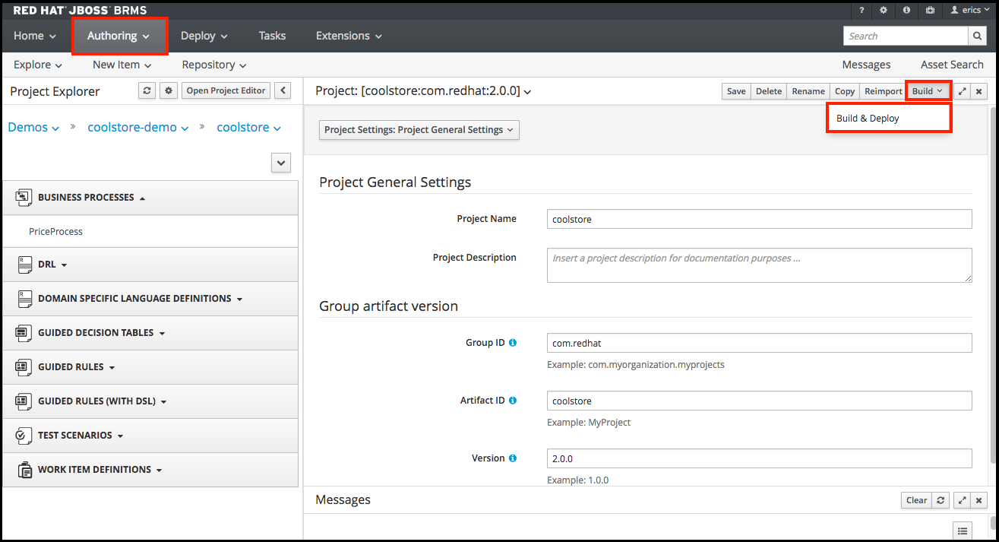
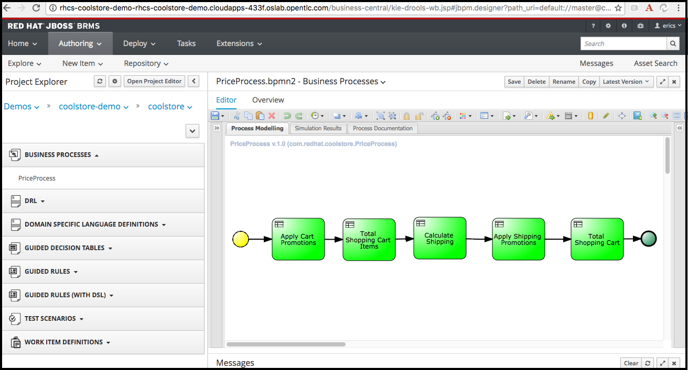
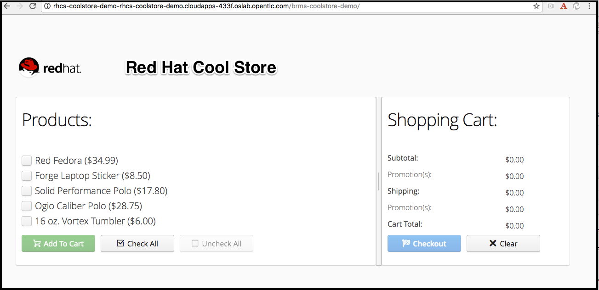

:scrollbar:
:data-uri:
:toc2:

= BRMS CoolStore Demo on OpenShift 3.3 

== はじめに
本手順では、Red Hat Demo Central (GitHub上)にあるBRMSのでもアプリ CoolStoreDemo を OpenTLC上の OpenShift3.3の環境に構築するための手順を示します。

==== 前提条件
次の権限が必要となりますのであらかじめご準備ください
* Red Hat の Training System https://labs.opentlc.com[OPEN-TLC] の利用権限
* JBoss EAP / JBoss BRMS のアーカイブをダウンロードする権限(サブスクリプション)が必要

:numbered:

== OpenShift 3.3 環境入手

=== OpenShift 3.3 Demo/Fastrax Lab 環境作成
. デモ環境手配
  https://labs.opentlc.com にアクセスし、Service > Catalogs > OpenShift 3.3 FastAdv を orderする +
  プロビジョニングには40分程度かかります。

. Ansible 実行環境のサーバにSSH接続
  * 接続ユーザー名、接続先の4桁の識別子(コマンド例では、**${GUID}**) は環境に応じて変更が必要
+
----
$ ssh -l mamurai-redhat.com oselab-${GUID}.oslab.opentlc.com
$ sudo su -
----

. 設定用のツールをダウンロード (oselab サーバで実行)
+
----
# git clone https://github.com/mamurai/Provisioning_OpenShift3.3_FastAdv.git
----

=== OpenShift 認証設定の変更 (oselab サーバで実行)
初期インストール直後は、OpenShiftの認証が deny_all になっているので、Ansible Playbook **99_JBoss_BRMS_Coolstore_Demo.yaml** を実行し次の2つの設定を実施します。

  * 初期状態では WebConsole へのログインが無効になっているので、HTPASSWD に変更後、Openshift Masterを再起動
  * OpenShift ユーザーを作成
  * CoolStore Demo ソースコードのDLと展開 (master1:/root/rhcs-coolstore-demo-master)

==== Ansible Playbook の実行

* ユーザー作成の Playbook **99_JBoss_BRMS_Coolstore_Demo.yaml** を実行
+
----
# ansible-playbook /root/Provisioning_OpenShift3.3_FastAdv/playbooks/99_JBoss_BRMS_Coolstore_Demo.yaml 
----
+
.初期ユーザ 一覧
[cols="1,1,2",options="header"]
|====
^.^| User ^.^| Passwd ^.^| 補足
| oscadm | r3dh4t1! | 管理者ユーザー cluster-admin 権限
| openshift-dev | devel | 一般ユーザー
|====

=== BRMS と EAP7.0 のアーカイブを 取得し master1 へ展開
master1 への直接の ssh接続はできないため、oselab サーバを経由して転送する

. ローカルPCにて access.redhat.com より アーカイブを取得
+
.取得アーカイブ一覧
[cols="1,2,2",options="header"]
|====
^.^| 種別 ^.^| ファイル名 ^.^| 格納場所
| JBoss BRMS 6.4 |jboss-brms-6.4.0.GA-deployable-eap7.x.zip .2+^.^| master1:/rhcs-coolstore-demo-master/installs
| JBoss EAP 7 | jboss-eap-7.0.0-installer.jar
|====
. アーカイブをローカルのPCから oselab へ scp
+
----
$ scp jboss-eap-7.0.0-installer.jar mamurai-redhat.com@oselab-${GUID}.oslab.opentlc.com:./
$ scp jboss-brms-6.4.0.GA-deployable-eap7.x.zip  mamurai-redhat.com@oselab-${GUID}.oslab.opentlc.com:./
----
. oselab から master1.example.com へ アーカイブをscp
.. oselab サーバに ssh接続
+
----
$ ssh -l mamurai-redhat.com oselab-${GUID}.oslab.opentlc.com
----
.. root にスイッチ
+
----
$ sudo su -
----
.. master1.example.com へアーカイブを転送
+
----
# scp /home/mamurai-redhat.com/jboss-brms-6.4.0.GA-deployable-eap7.x.zip master1.example.com:./rhcs-coolstore-demo-master/installs
# scp /home/mamurai-redhat.com/jboss-eap-7.0.0-installer.jar master1.example.com:./rhcs-coolstore-demo-master/installs
----

=== CoolStore Demo のインストール
. CoolStore Demo インストール　コマンド実行　(master1)
.. master1.example.com へ ssh接続
+
----
# ssh master1.example.com
----
.. rhcs-coolstore-demo-master　へ移動
+
----
# cd  /root/rhcs-coolstore-demo-master
----
.. インストーラー init.sh を masterサーバのアドレス 192.168.0.101 を引数として実行
+
----
# ./init.sh 192.168.0.101
----
. OpenShift route オブジェクトの再作成 (master1 サーバで OpenShiftアプリ作成完了後に実施) +
デフォルトでは アプリのURLが rhcs-coolstore-demo.192.168.0.101.xip.io で作成されるのでアクセスできない。
.. 既存の route rhcs-coolstore-demo を削除
+
----
# oc delete route rhcs-coolstore-demo
----
.. service rhcs-coolstore-demo から route を自動生成
+
----
# oc expose service rhcs-coolstore-demo
----
.. 作成した route の確認
+
----
# oc describe route rhcs-coolstore-demo
Name:			rhcs-coolstore-demo
Namespace:		rhcs-coolstore-demo
Created:		24 minutes ago
Labels:			app=rhcs-coolstore-demo
Annotations:		openshift.io/host.generated=true
Requested Host:		rhcs-coolstore-demo-rhcs-coolstore-demo.cloudapps-d3e2.oslab.opentlc.com
			  exposed on router router 24 minutes ago
Path:			<none>
TLS Termination:	<none>
Insecure Policy:	<none>
Endpoint Port:		8080-tcp

Service:	rhcs-coolstore-demo
Weight:		100 (100%)
Endpoints:	10.1.3.2:9999, 10.1.3.2:8080, 10.1.3.2:9990 
----

=== CoolStore Demo の実行
. Business Central にアクセスしアプリのビルドを実施する
.. Authoring > Project Authoring を選択。画面上の **Open Project Editor** ボタンをクリック
.. Build > Build & Deploy をクリック
+

+
.接続URL一覧
[cols="1,3,1",options="header"]
|====
^.^| 種別 ^.^| URL ^.^| ID/Passwd
^.| Business Central | http://rhcs-coolstore-demo-rhcs-coolstore-demo.cloudapps-${GUID}.oslab.opentlc.com/business-central | u:erics / p:jbossbrms1!
^.| CoolStore Demo +
(Web アプリ) | http://rhcs-coolstore-demo-rhcs-coolstore-demo.cloudapps-${GUID}.oslab.opentlc.com/brms-coolstore-demo/ ^.^| -
|====

. Business Central にアクセス
+
.(例)Cool Store Demo ビジネスプロセスフロー画面

+
.ビジネスルールフロー　各ビジネスルールタスクの概要紹介
[cols="1,2",options="header"]
|====
| ビジネスルールタスク名 | 処理概要
| Apply Cart Promotions | Red Fedra のみ 25% 割引
| Total Shopping Cart Items | 金額計算 (単価 x 数量)
| Calculate Shipping | 送料の設定
| Apply Shipping Promotions | 合計75以上の場合は送料無料
| Total Shopping Cart | カート金額の再計算
|====
ルールを変更した場合、上記「CoolStore Demo の実行」の手順でプロジェクトのBuild & Deploy 実行が必要となります。
. Cool Store Demo にアクセス
+
.(例)Cool Store Demo アプリケーション画面

+
カートに商品を入れると予め登録されたルールに従い割引処理が実施されます。

以　上
