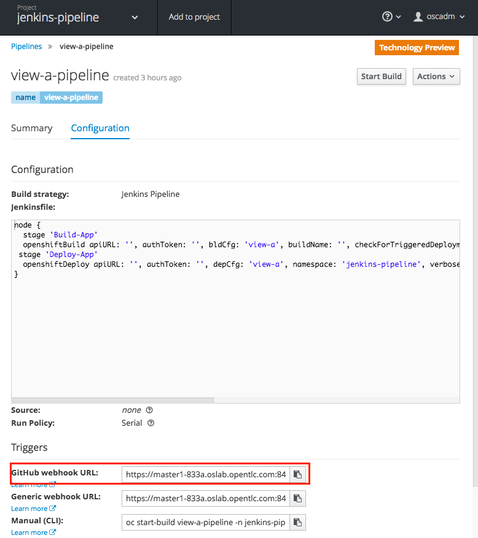
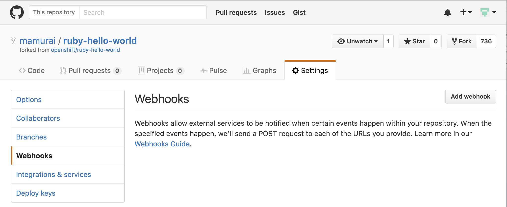
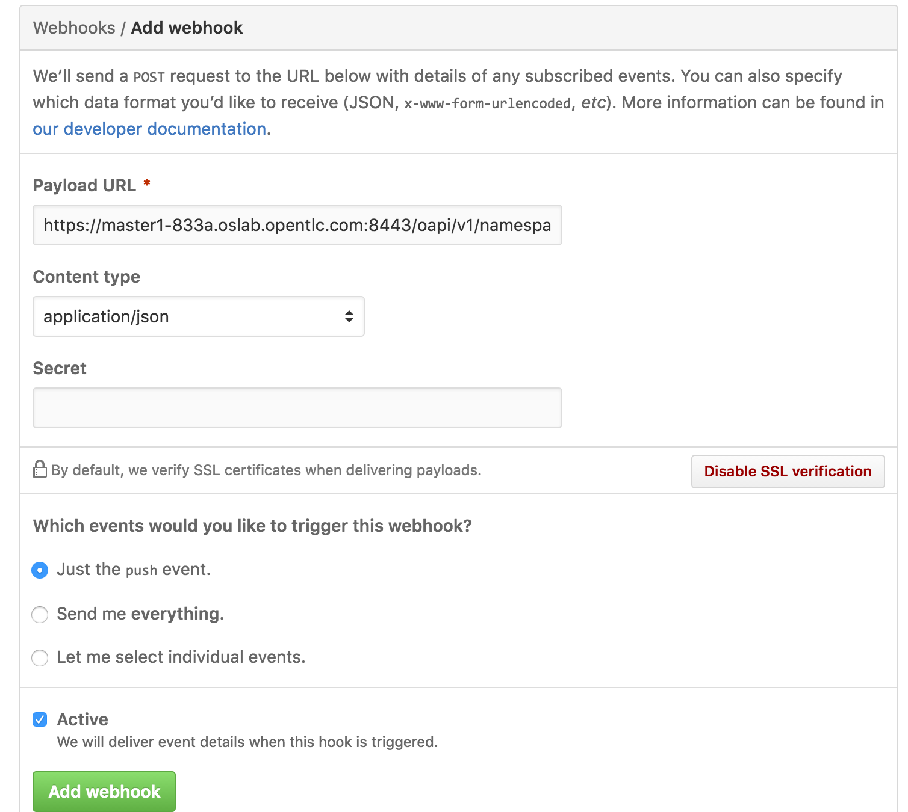
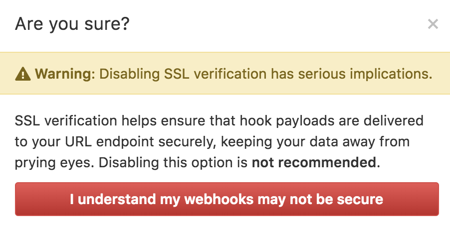
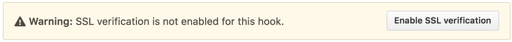
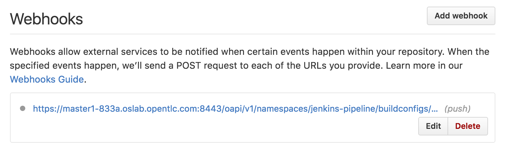
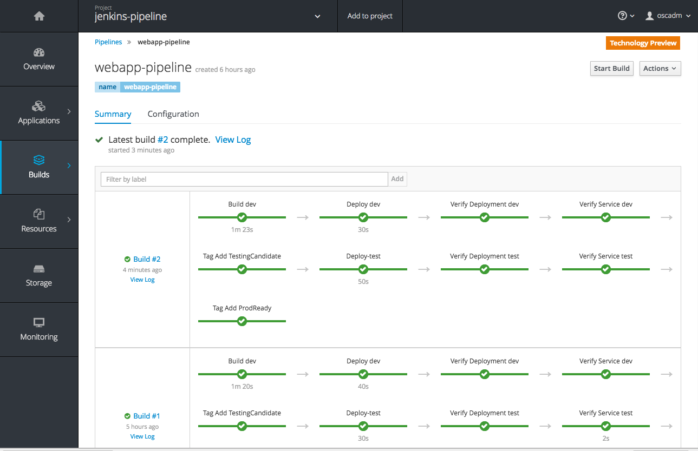

:scrollbar:
:data-uri:
:toc2:

= OpenShift 3.3 Jenkins Pileline Sample 

:numbered:

== OpenShift 3.3 環境入手

=== OpenShift 3.3 Demo/Fastrax Lab 環境作成
. デモ環境手配
  https://labs.opentlc.com にアクセスし、Service > Catalogs > OpenShift 3.3 FastAdv を orderする +
  プロビジョニングには40分程度かかります。

. Ansible 実行環境のサーバにSSH接続
  * 接続ユーザー名、接続先の4桁の識別子(コマンド例では、**${GUID}**) は環境に応じて変更が必要
+
----
$ ssh -l mamurai-redhat.com oselab-${GUID}.oslab.opentlc.com
$ sudo su -
----

. 設定用のツールをダウンロード (oselab サーバで実行)
+
----
# git clone https://github.com/mamurai/Provisioning_OpenShift3.3_FastAdv.git
----

=== OpenShift 認証設定の変更 (oselab サーバで実行)
初期インストール直後は、OpenShiftの認証が deny_all になっているので、Ansible Playbook **01_IdentityProvider.yaml** を実行し次の2つの設定を実施します。

  * 初期状態では WebConsole へのログインが無効になっているので、HTPASSWD に変更後、Openshift Masterを再起動
  * OpenShift ユーザーを作成

==== Ansible Playbook の実行

* ユーザー作成の Playbook **01_IdentityProvider.yaml** を実行
+
----
# ansible-playbook /root/Provisioning_OpenShift3.3_FastAdv/playbooks/01_IdentityProvider.yaml
----
+
.初期ユーザ 一覧
[cols="1,1,2",options="header"]
|====
| User | Passwd | 補足
| oscadm | r3dh4t1! | 管理者ユーザー cluster-admin 権限
| andrew | redhat1! | 一般ユーザー
| karla | redhat1! | 一般ユーザー
|====

=== Metrics の有効化
本環境はデフォルトでは、CPU/Memory/Network のリソースを取得する Metricsが無効になっているので、Ansible-Playbook **02_Metrics_deploy.yaml** を実行しMetricsを有効にします。

  * master-config.yaml に metricsPublicURL を追記し、openshift-master を再起動
  * metrics-deployer を実行し、metrics関連のコンテナを起動

==== Ansible Playbook の実行

* Metrics 設定の Playbook **02_Metrics_deploy.yaml** を実行
+
----
# ansible-playbook /root/Provisioning_OpenShift3.3_FastAdv/playbooks/02_Metrics_deploy.yaml
----
     ** Metrics 関連の Podが起動されるまで待つ必要があります。完了すると以下の例のようになります。
+
----
# oc project openshift-infra
# oc get pod
NAME                         READY     STATUS      RESTARTS   AGE
hawkular-cassandra-1-faw83   1/1       Running     0          1h
hawkular-metrics-z7n4d       1/1       Running     0          1h
heapster-fl1kb               1/1       Running     1          1h
metrics-deployer-pwwzd       0/1       Completed   0          1h
----
  * Metrics 有効化のため、Metrics Pod 起動後、初回のみ Hawkular Metrics の URLにアクセスします
+
----
[URL] https://metrics.cloudapps-${GUID}.oslab.opentlc.com/hawkular/metrics
----

=== Jenkins コンテナ と CICD パイプラインの作成

Jenkinsコンテナ起動、及び、CICDビルドパイプラインで操作するサンプルアプリのデプロイを実施ため、Ansible-Playbook **05_CICD_OpenShift-pipeline.yaml** を実行します。 + 

[NOTE]
本手順を利用したCICDパイプラインのデモはGoogle Drive 上のムービー https://drive.google.com/open?id=0B_SH4uhdyQisLUdlNUZqeFg0U00[OCP-Build-Pipeline-Demo.m4v] をダウンロードしてご確認ください。

.本スクリプトで作成するオブジェクト(概要)
[cols="2,3,2,3",options="header"]
|====
| Project | Type | Name | Notes
| jenkins-pipeline | route / service / pod など | jenkins | Jenkins コンテナ
| jenkins-pipeline | Build Config |webapp-pipeline | CICD Jenkinsパイプライン
| dev-pj | route / service / pod など | webapp | Webアプリ(開発) 帽子の色：黄
| dev-pj | service / pod など | database | Database(開発)
| test-pj | route / service / pod など | webapp | Webアプリ(テスト) 帽子の色：青
| test-pj | service / pod など | database | Database(テスト)
| prod-pj | route / service / pod など | webapp | Webアプリ(本番) 帽子の色：赤
| prod-pj | service / pod など | database | Database(本番)
|====

==== Ansible Playbook の作業概要

* Jenkins コンテナの起動 (未導入の場合のみ)
* データベース作成 (MySQLコンテナ) 
* サンプルアプリのビルド (ruby-hello-world を mamurai に Fork、一部改修したもの)
* Jenkins パイプライン作成

==== Ansible Playbook の実行

* Jenkins 設定の Playbook **05_CICD_OpenShift-pipeline.yaml** を実行
+
----
# ansible-playbook /root/Provisioning_OpenShift3.3_FastAdv/playbooks/extra/05_CICD_OpenShift-pipeline.yaml
----

==== コンテナの動作確認
* Web Console、Jenkins のログイン確認、及び、サンプルアプリの表示確認を実施します
  ** 下記に示すURLの **${GUID}** の部分はお使いの環境に合わせて変更してください
+
.URL一覧
[cols="1,4,1",options="header"]
|====
| 対象ページ | URL | ID/Pass
| Web Console | https://master1-${GUID}.oslab.opentlc.com:8443/ | oscadm / r3dh4t1!
| OpenShift Pipeline | https://master1-${GUID}.oslab.opentlc.com:8443/console/project/jenkins-pipeline/browse/pipelines | oscadm / r3dh4t1!
| Jenkins     | https://jenkins-sharedjenkins.cloudapps-${GUID}.oslab.opentlc.com | admin / r3dh4t1!
| WebApp(本番)  | http://webapp-prod-pj.cloudapps-${GUID}.oslab.opentlc.com/ | -
| WebApp(テスト)  | http://webapp-test-pj.cloudapps-${GUID}.oslab.opentlc.com/ | -
| WebApp(開発)  | http://webapp-dev-pj.cloudapps-${GUID}.oslab.opentlc.com/ | -
|====

==== GitHub との連携設定 (webhook設定)
GitHub上でソースがコミットされた際に自動的にビルドパイプラインが起動する、webhook の設定方法を紹介します。

[width="90%",cols="3,2",options="header"]
|====
^.^| 画面 ^.^| 説明
|  | OpenShift WebConsole の Pipeline 画面から GitHub webhook URL を取得します。 +
 + 
 なお、WebhookのURLは次の通りです。 + 
 https://**{WebConsoleURL}**/oapi/v1/namespaces/**{プロジェクト名}**/buildconfigs/**{パイプライン名}**/**{secret}**/github
 
|  | ソースを格納する GitHub のリポジトリにて +
Settings > webhooks > Add webhook ボタンをクリック
|  | 1) 取得したGitHub webhook URL を 入力 + 
2) Disabale SSL verification をクリック + 
3) Add Webhook をクリック
|  | Disable SSL verification をクリックした際に警告がでます。
|  | SSL verification is not enabled  の状態になります
|  | webhook の設定が完了すると左図のようになります。この状態で,GitHub上のソースを一部変更しコミットすると自動でOpenShiftのビルドパイプラインが実行されることを確認できます。
|====

==== OpenShift Pipeline 画面イメージ

以　上
