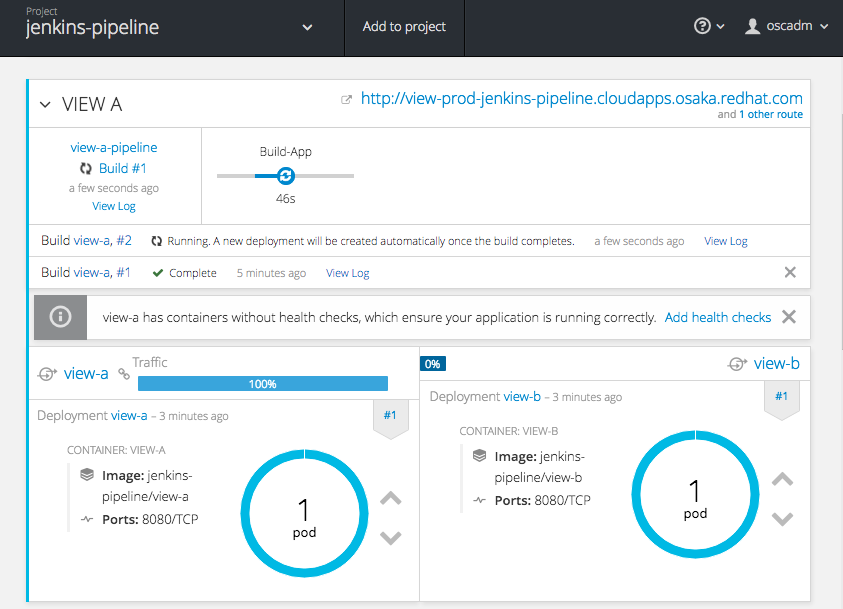
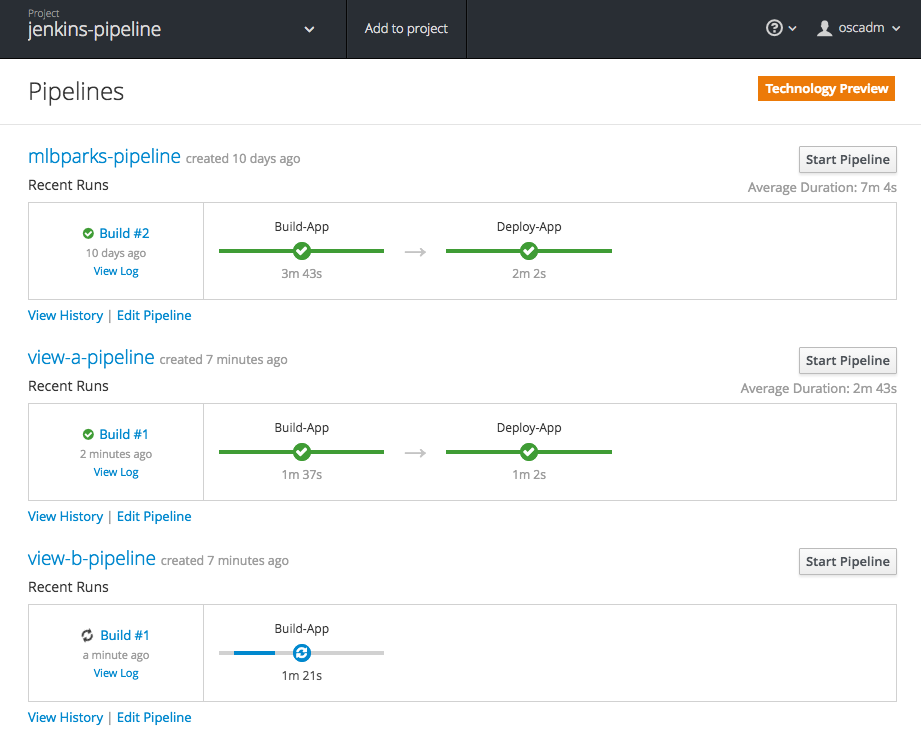

:scrollbar:
:data-uri:
:toc2:

= OpenShift 3.3 Jenkins Pileline Sample 

:numbered:

== OpenShift 3.3 環境入手

=== OpenShift 3.3 Demo/Fastrax Lab 環境作成
. デモ環境手配
  https://labs.opentlc.com にアクセスし、Service > Catalogs > OpenShift 3.3 FastAdv を orderする +
  プロビジョニングには40分程度かかります。

. Ansible 実行環境のサーバにSSH接続
  * 接続ユーザー名、接続先の4桁の識別子(コマンド例では、**${GUID}**) は環境に応じて変更が必要
+
----
$ ssh -l mamurai-redhat.com oselab-${GUID}.oslab.opentlc.com
$ sudo su -
----

. 設定用のツールをダウンロード (oselab サーバで実行)
+
----
# git clone https://github.com/mamurai/Provisioning_OpenShift3.3_FastAdv.git
----

=== OpenShift 認証設定の変更 (oselab サーバで実行)
初期インストール直後は、OpenShiftの認証が deny_all になっているので、Ansible Playbook **01_IdentityProvider.yaml** を実行し次の2つの設定を実施します。

  * 初期状態では WebConsole へのログインが無効になっているので、HTPASSWD に変更後、Openshift Masterを再起動
  * OpenShift ユーザーを作成
+  
----
# ansible-playbook /root/Provisioning_OpenShift3.3_FastAdv/playbooks/01_IdentityProvider.yaml
----
+
.初期ユーザ 一覧
[cols="1,1,2",options="header"]
|====
| User | Passwd | 補足
| oscadm | r3dh4t1! | 管理者ユーザー cluster-admin 権限
| andrew | redhat1! | 一般ユーザー
| karla | redhat1! | 一般ユーザー
|====

=== Metrics の有効化
本環境はデフォルトでは、CPU/Memory/Network のリソースを取得する Metricsが無効になっているので、Ansible-Playbook **02_Metrics_deploy.yaml** を実行しMetricsを有効にします。

  * master-config.yaml に metricsPublicURL を追記し、openshift-master を再起動
  * metrics-deployer を実行し、metrics関連のコンテナを起動
+
----
# ansible-playbook /root/Provisioning_OpenShift3.3_FastAdv/playbooks/02_Metrics_deploy.yaml
----
     ** Metrics 関連の Podが起動されるまで待つ必要があります。完了すると以下の例のようになります。
+
----
# oc project openshift-infra
# oc get pod
NAME                         READY     STATUS      RESTARTS   AGE
hawkular-cassandra-1-faw83   1/1       Running     0          1h
hawkular-metrics-z7n4d       1/1       Running     0          1h
heapster-fl1kb               1/1       Running     1          1h
metrics-deployer-pwwzd       0/1       Completed   0          1h
----
  * Metrics 有効化のため、Metrics Pod 起動後、初回のみ Hawkular Metrics の URLにアクセスします
+
----
[URL] https://metrics.cloudapps-${GUID}.oslab.opentlc.com/hawkular/metrics
----
  
=== Jenkins コンテナとサンプルアプリのデプロイ
Jenkinsコンテナ起動、及び、ビルドパイプラインで操作するサンプルアプリのデプロイを実施ため、Ansible-Playbook **03_Jenkins_deploy.yaml** を実行します。 + 

[NOTE]
Teck-Preview の OpenShift-Build-Pipeline を利用する場合は、本項目は実行せず、次項の **Jenkinsコンテナとサンプルアプリのデプロイ (Build-Pipeline)** を実施してください。 

  * サンプルアプリ (mlbparks を mamurai に Forkしたもの) のビルド
  * Jenkins コンテナの起動
+
----
# ansible-playbook /root/Provisioning_OpenShift3.3_FastAdv/playbooks/03_Jenkins_deploy.yaml
----
     ** JenkinsコンテナのPodが起動されるまで待つ必要があります。完了すると以下の例のようになります。
+
----
# oc project sharedjenkins 
# oc get pod 
NAME              READY     STATUS    RESTARTS   AGE
jenkins-1-5phh8   1/1       Running   1          21h
----

* Web Console、Jenkins のログイン確認、及び、サンプルアプリの表示確認を実施します
  ** 下記に示すURLの **${GUID}** の部分はお使いの環境に合わせて変更してください
+
.URL一覧
[cols="1,3,1",options="header"]
|====
| 対象ページ | URL | ID/Pass
| Web Console | https://master1-${GUID}.oslab.opentlc.com:8443/ | oscadm / r3dh4t1!
| Jenkins     | https://jenkins-sharedjenkins.cloudapps-${GUID}.oslab.opentlc.com | admin / r3dh4t1!
| Sample App  | http://mlbparks-mlbparks.cloudapps-${GUID}.oslab.opentlc.com/ | -
|====

=== Jenkinsコンテナとサンプルアプリのデプロイ (Build-Pipeline)
Jenkinsコンテナ起動、及び、ビルドパイプラインで操作するサンプルアプリのデプロイ、ビルドパイプライン作成のため、Ansible-Playbook **extra/03_Jenkins_pipeline-deploy.yaml** を実行します。 + 
OpenShift の ビルドパイプラインを利用するためには、Jenkins と 管理対象アプリケーションを同じプロジェクトに作成する必要があります。 今回のサンプルでは、**jenkins-pipeline** プロジェクトに双方のオブジェクトを格納しています。 

  * Jenkins コンテナの起動
  * Jenkins パイプライン用のテンプレート作成
  * サンプルアプリ (mlbparks を mamurai に Forkしたもの) のビルド
  * Jenkins ビルドパイプライン の ビルド
+
----
# ansible-playbook /root/Provisioning_OpenShift3.3_FastAdv/playbooks/extra/03_Jenkins_pipeline-deploy.yaml
----
     ** JenkinsコンテナのPodが起動されるまで待つ必要があります。完了すると以下の例のようになります。
+
----
# oc project jenkins-pipeline 
# oc get pod
NAME                       READY     STATUS      RESTARTS   AGE
jenkins-1-vnsds            1/1       Running     1          36m
mlbparks-1-build           0/1       Completed   0          30m
mlbparks-2-thook           1/1       Running     0          23m
mlbparks-mongodb-1-h4sxr   1/1       Running     0          31m
----
+
なお、全ての処理が完了したのちに、WebConsoleにアクセス、+
jenkins-pipeline プロジェクトを選択 > Pipeline mlbparks-pipeline をクリックすると、パイプライン実行結果が確認できます。

.WebConsole パイプライン実行結果
image::images/OpenShift3.3_Jenkins_Sample_001.png[width="75%"]

=== Jenkins Build-Pipeline A/B Testing Sample のデプロイ

OpenShift3.3 の 新機能である 1 つの Route に複数のサービスを所属させ着弾させる比率を変更する A/B Testing のサンプルアプリケーションをデプロイするため、Ansible-Playbook **extra/04_AB_Testing-Jenkins.yaml** を実行します。 + 
なお、本サンプルでも ビルドパイプラインを作成しておりますので、Jenkinsコンテナと同じプロジェクトに作成する必要があります。 サンプルスクリプトでは、jenkins-pipeline プロジェクトが存在しない場合のみ、プロジェクトの作成、及び、Jenkins コンテナのデプロイを実施します。

  * Jenkins コンテナの起動 ( jenkins-pipeline プロジェクトが存在しない場合のみ )
  * サンプルアプリ (ruby-hello-world を mamurai に Fork、一部改修したもの) のビルド 
  ** A/B と2つのアプリをデプロイする際、環境変数 COLOR で、画面上の画像を選択できるようにしています。(red, blue, yellowのみ)
  * Jenkins ビルドパイプライン の ビルド
+
----
# ansible-playbook /root/Provisioning_OpenShift3.3_FastAdv/playbooks/extra/04_AB_Testing-Jenkins.yaml
----

* Ansible-Playbook 実行後、view-a, view-b アプリケーションの作成が完了したのち、Pipeline からのビルドを実行します。
** Build Pipeline の名称確認
+
----
# oc get bc
NAME                TYPE              FROM         LATEST
view-a              Source            Git          2
view-a-pipeline     JenkinsPipeline                1
view-b              Source            Git          2
view-b-pipeline     JenkinsPipeline                1
----

** Jenkins コンテナを確認すると、Jenkins側に Build Config と 同じ名称の Build Pipeline が作成されていることがわかります。
+
.Jenkins ログイン後のTopページ
image::images/OpenShift3.3_Jenkins_Sample_003.png[width="75%"]

** Playbook では Build Pipeline の定義のみ実施しているので、コマンドラインにて Pipeline の ビルドを開始します。
+
----
# oc start-build view-a-pipeline
# oc start-build view-b-pipeline
----
+
build 実施後、OpenShift管理コンソールに次のイメージのように、ビルドパイプラインが表示されます
+
.Build Pipeline からのビルド実行中の Overview 画面

+
.Pipeline の一覧ページ

* A/B Testing Router 側の設定変更

本例では、本番用のRoute view-prod と テスト用の route view−test 二つを準備しています。初期状態では、本番用はサービス view-a のみに、テスト用は サービス view-b のみに振り分けられます。

.route毎のロードバランス設定
[cols="1,1,1,4",options="header"]
|====
^.^| route ^.^| view-a ^.^| view-b ^.^| URL
| view-prod | 100 % | 0 % | http://view-prod-jenkins-pipeline.cloudapps-${GUID}.oslab.opentlc.com 
| view-test | 0 % | 100 % | http://view-test-jenkins-pipeline.cloudapps-${GUID}.oslab.opentlc.com 
|====

* Route の設定を確認するコマンド
+
----
# oc get route
NAME        HOST/PORT                                               PATH      SERVICES                  PORT       TERMINATION
jenkins     jenkins-jenkins-pipeline.cloudapps.osaka.redhat.com               jenkins                   <all>      edge/Redirect
view-prod   view-prod-jenkins-pipeline.cloudapps.osaka.redhat.com             view-a(100%),view-b(0%)   8080-tcp   
view-test   view-test-jenkins-pipeline.cloudapps.osaka.redhat.com             view-a(0%),view-b(100%)   8080-tcp  
----

* route の設定を変更し、着弾するサービスを変更する場合の例　( view-prod を view-b のみ着弾するように変更)
+
----
# oc set route-backends  view-prod  view-a=0 view-b=100 -n jenkins-pipeline 
----
** Route の設置を確認すると、Serviceの割合が変更されたことが確認できます。
+
----
# oc get route view-prod
NAME        HOST/PORT                                               PATH      SERVICES                  PORT       TERMINATION
view-prod   view-prod-jenkins-pipeline.cloudapps.osaka.redhat.com             view-a(0%),view-b(100%)   8080-tcp 
----
+
この方法で、アプリ改修、本番で参照していない方のサービスにデプロイ、検証用の route view-test でまず動作確認を実施し、問題がなければ、本番側の route view-prod の参照先サービスを、検証済みのサービスに切り替えることで、ダウンタイム0でのサービス切り替えが実現可能です。

== Jenkins ビルドパイプライン関連の設定

本章は、上記、**1.4. Jenkins コンテナとサンプルアプリのデプロイ** を実施した場合の設定になります。 +
**1.5. Jenkinsコンテナとサンプルアプリのデプロイ (Build-Pipeline)** 、**1.6. Jenkins Build-Pipeline A/B Testing Sample のデプロイ** のみを実施された場合は対象外となります。

=== Jenkins セキュリティ設定変更

GitHub の Webhook と Jenkins Pipeline 連携のためセキュリティレベルを変更する

. jenkins にログイン

. セキュリティレベルを変更する
  * Manage Jenkins > Configure Global Security をクリック
  * Configure Global Security ページにて 以下の設定を実施
    ** Allow users to sign up にチェックを入れる
    ** Authorization を Logged-in users can do anything に変更

=== Jenkins Pipeline の作成 (mlbparks の ビルド＋デプロイ)

. Jenkins にログインし、ビルドパイプラインを作成
  * New Item  > Item Name に名称 を設定 > Pipeline を選択 > OK をクリック
  * [Trigger builds remotely] にチェックを入れ 任意の Authentication Token を設定する
     [jenkins_mlbparks_build_token] を仮に設定
  * Pipeline > Definition を Pipeline script を選択し 次のスクリプトを設定する
    ** ここではビルド->デプロイのみの簡単なパイプラインのみ設定しています。必要に応じてスクリプトの中を書き換え絵ください。
+
----
node {
	stage 'Build-App'
	openshiftBuild apiURL: '', authToken: '', bldCfg: 'mlbparks', buildName: '', checkForTriggeredDeployments: 'false', commitID: '', namespace: 'mlbparks', showBuildLogs: 'false', verbose: 'false', waitTime: '1800000'

	stage 'Deploy-App'
	openshiftDeploy apiURL: '', authToken: '', depCfg: 'mlbparks', namespace: 'mlbparks', verbose: 'false', waitTime: '1800000'
}
----

. Buld Now をクリックし Pipeline Build を実行
* 画面表示のサンプル

.Jenkins Pipeline サンプル
image::images/OpenShift3.3_Jenkins_Sample_002.png[]

=== GitHub より Webhookの設定を実施する

. サンプルアプリ格納場所に移動
  * 上記で実行したplaybook [02_Jenkins_deploy.yaml] の変数 [app_template] にテンプレートの雛形があります。この中の [GIT_URI] がソースリポジトリとなります。
+
----
https://github.com/mamurai/openshift3mlbparks
----

. WebHook の設定
  * Settings > Webhooks > Add Webhook より Webhook設定画面を開く
  * Payload URL に Jenkins Pipeline Job と Tokenを含むURLを追記
    ** Payload URLの例
+
----
https://jenkins-sharedjenkins.cloudapps-${GUID}.oslab.opentlc.com/job/mlbparks_build/build?token=jenkins_mlbparks_build_token
----
  * Disable SSL verification をクリックする
  * Add Webhook をクリックすると、Jenkins Pipline 側で ビルドが実行されます
  * 以降は、対象のソースに Commit が走れば OpenShift側のビルドバイプラインが自動実行されます。

以　上
