:scrollbar:
:data-uri:
:toc2:

= JBoss Data Virtualization インストールガイド

:numbered:

== はじめに
=== このドキュメントについて
Red Hat JBoss Data Virtualization インストールガイド (以下、本資料)は Red Hat JBoss
Data Virtualization (以下、JDV) 、Red Hat JBoss Developer Studio (以下、JBDS)のイン
ストール手順と、それに関連する各種の情報を記載します。

=== インストールする製品
本資料では以下の製品をインストールします。
[cols="1,3,1",options="header"]
|====
^.^|カテゴリ ^.^| 製品 ^.^| バージョン
^.^|サーバ | https://access.redhat.com/products/red-hat-jboss-data-virtualization/[Red Hat JBoss Data Virtualization (JDV)] | 6.3.1
1.2+^.^|関連ツール | http://developers.redhat.com/products/devstudio/download/?referrer=jbd[Red Hat JBoss Developer Studio (JBDS)] | 8.1.0
|https://devstudio.jboss.com/updates/8.0/integration-stack/[Red Hat JBoss Developer Studio Integration Stack] |8.0.7
|====

インストール製品は以下になります。
[cols="1,3",options="header"]
|====
^.^| 製品 ^.^| 媒体
| JDV 6.3.0 | jboss-dv-6.3.0-1-installer.jar
| JDV 6.3.1 patch | jboss-dv-6.3.1-patch.jar
| JBDS 8.1.0 | jboss-devstudio-8.1.0.GA-installer-standalone.jar
| JBDS IS 8.0.7 | jbdevstudio-integration-stack-updatesite-8.0.7.GA.zip 
|====

=== 環境
本資料は以下の環境での動作を確認しています。

[cols="1,3",options="header"]
|====
^.^|カテゴリ ^.^|製品
| OS(*1) | Windows 8.1 - 64bit 版 + 
Red Hat Enterprise Linux 7 - 64bit 版 (RHEL7) +
Mac OS X
|JVM | OpenJDK 1.8 +
Oracle JDK 1.8 (*2)
|====

(*1) 本資料で利用する画面は Mac OS X とします。 +
(*2) JVM は 1.7 もサポートされます。

ハードウェアとしては以下の環境を推奨します。
[cols="1,3",options="header"]
|====
^.^|カテゴリ ^.^|製品
|HDD | 空き容量 2GB 以上
|RAM | 4GB 以上
|====

また、資料の中で以下の変数を利用して記載を行います。変数そのものの設定は不要です。
[cols="1,1,1",options="header"]
|====
^.^|変数 ^.^|内容 ^.^|例
|JBOSS_HOME | JDVのインストールディレクトリ | /home/gues/jdv6.3
|====

その他、環境に関する詳細は以下のURLをご確認ください。

* https://access.redhat.com/articles/703663
* https://access.redhat.com/documentation/en/red-hat-jboss-data-virtualization/6.3/paged/installation-guide/chapter-3-platform-requirements

== JDVの基本的なインストール
=== 全体の流れ
JDVのインストールは、次の順序で実施します。なお、JDV6.2までは、JBoss EAP を個別でインストールしておりましたが、JDV6.3 より JDVのインストーラーにJBoss EAPのインストールも含まれております。

  * JDVのインストール
  * JDVパッチの適用

=== JDV のインストール
JDVのインストーラーは JAR形式で配布されておりますので、java -jar コマンドでインストーラを起動します。

----
$ java -jar jboss-dv-6.3.0-1-installer.jar 
----

[width="75%",cols="3,2",options="header"]
|====
^.^| 画面 ^.^| 説明
| 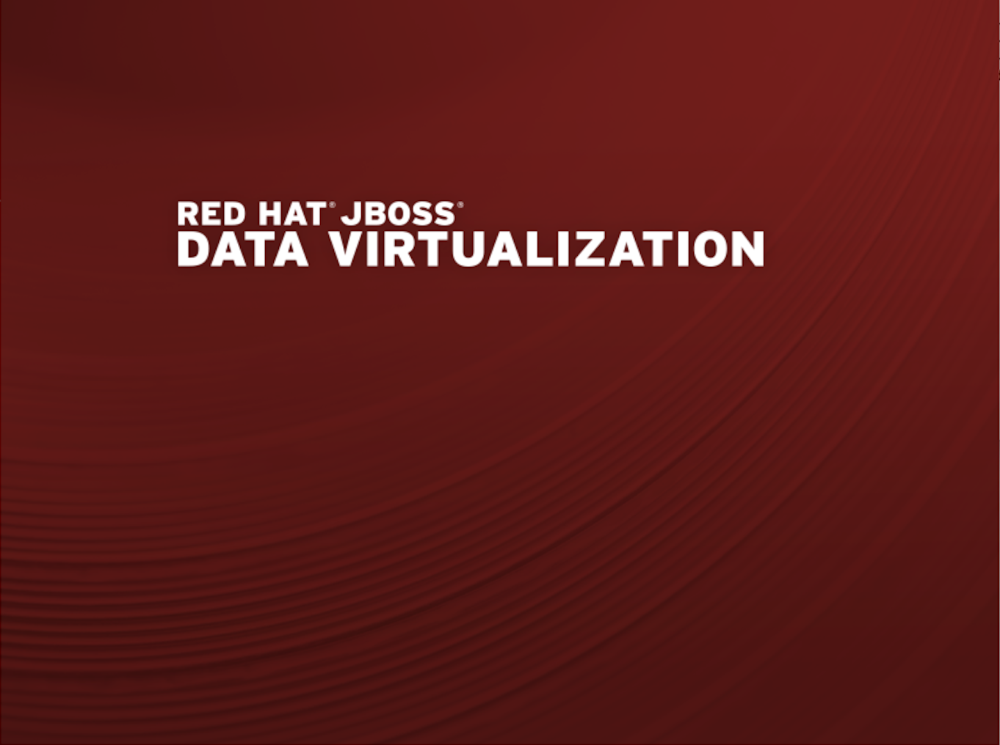 | インストーラが起動します。
| 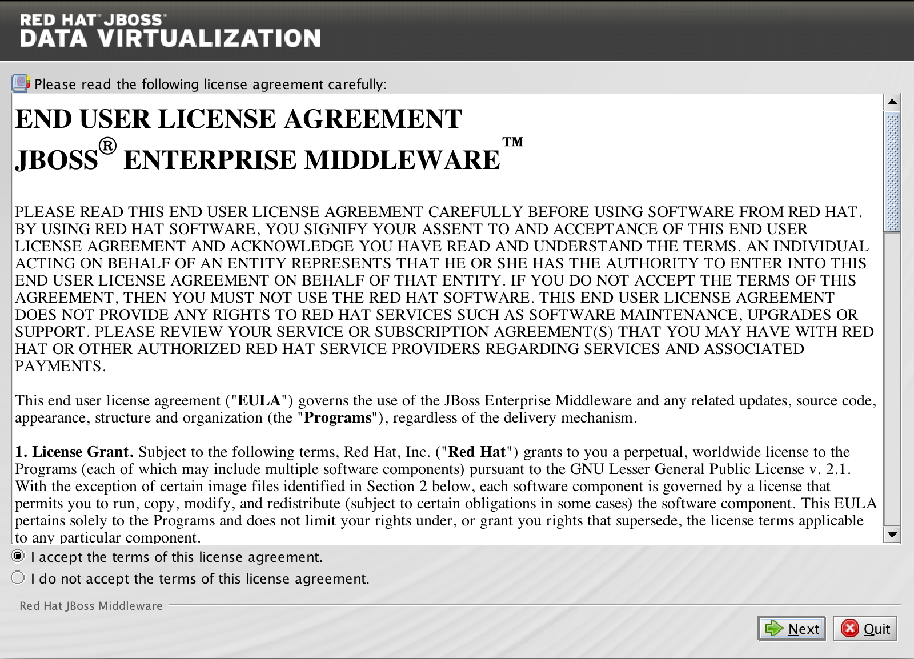 | ライセンスの確認を行います。同意して「Next」をクリックします。
| 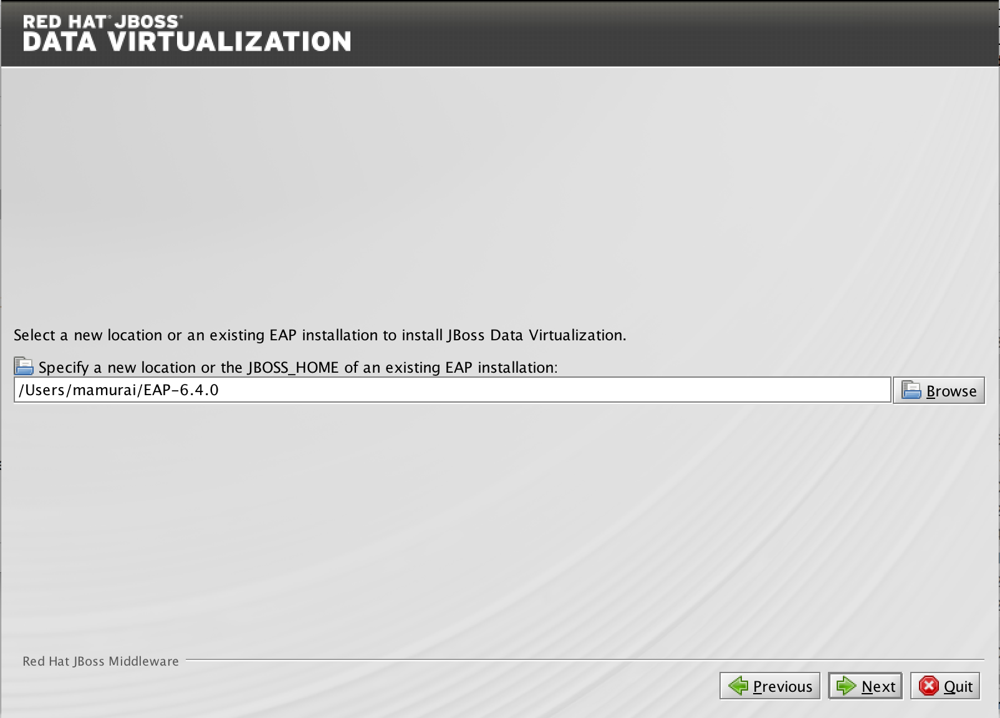 | JDVのインストールディレクトリを指定し、 **「Next」** をクリックします
| 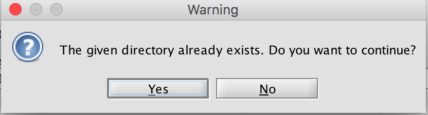 | 既にディレクトリが存在する場合は警告が表示されます
| 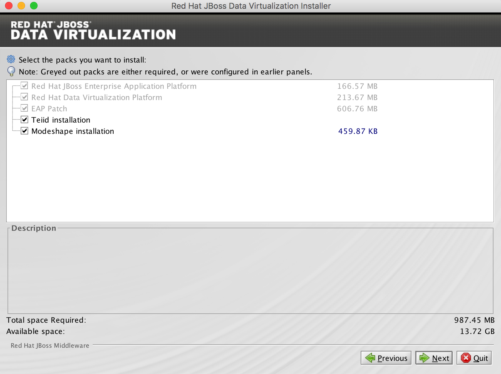 | インストールする JDV のパッケージを選択します。そのまま「Next」をクリックします。
| 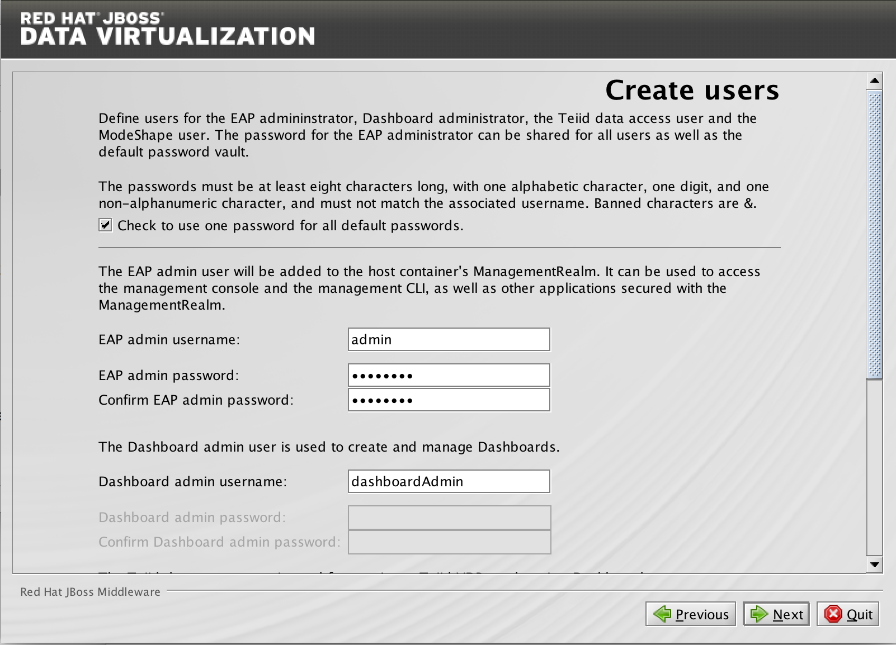 | Create users 画面ではユーザの作成を行います。ここでは以下のユーザを作成します。 +
* admin (管理者) +
* teiidUser (JDV ユーザ) +
* dashboardAdmin (ダッシュボード管理者) +
* modeshapeUser(modeshape ユーザ) +
個別にパスワードを設定するのは煩雑であるため、「Check to use onepassword for all defaultpasswords」にチェックを入れます。
| 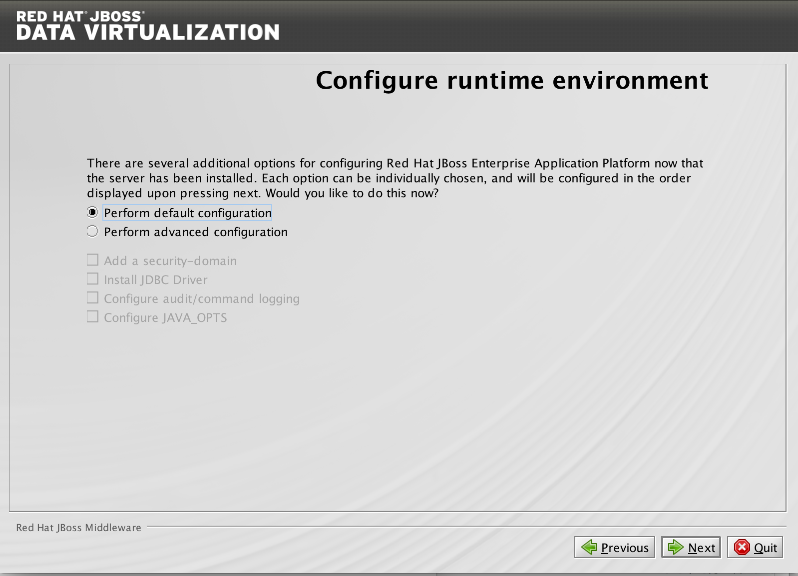 | Configuration runtimeenvironment 画面はそのまま「Next」をクリックします。
| 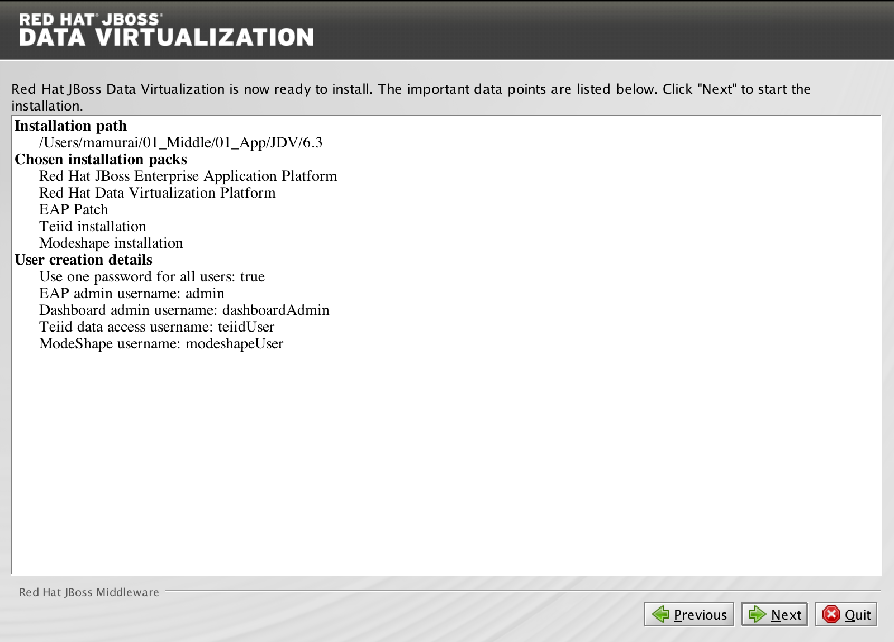 | インストール設定を確認します。「Next」をクリックするとインストールが始まります。
| 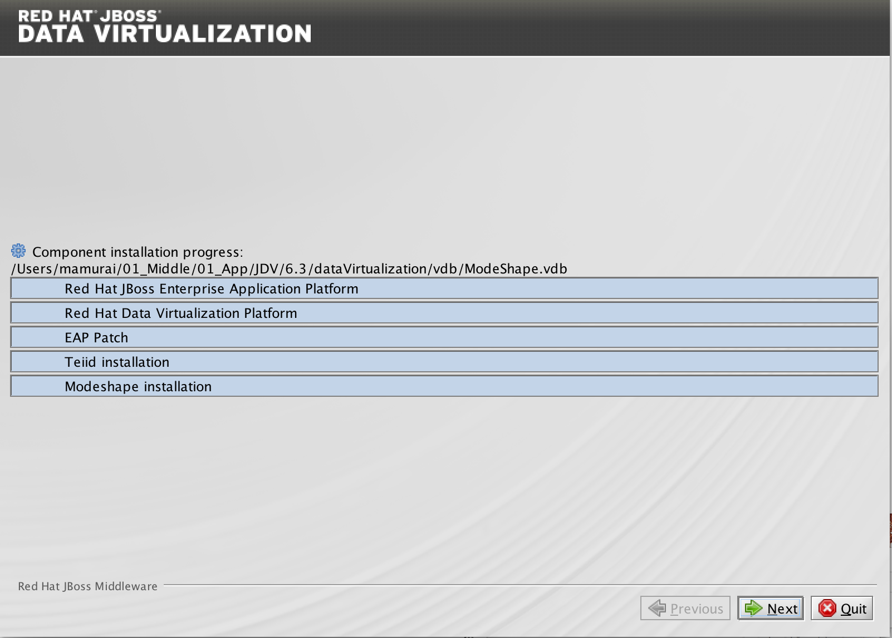 | ファイルの展開を行います。展開完了後「Next」をクリックします。
| 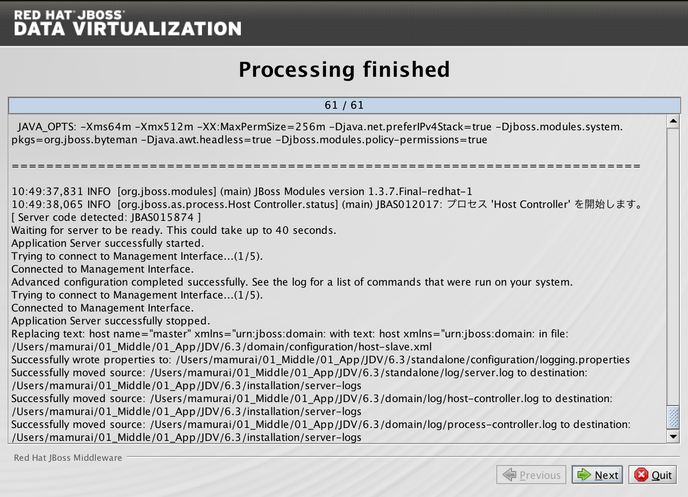 | JDV のインストール設定はEAPのインストール、パッチ適用後、起動しているEAPに設定コマンドを流し込むという形で行われます。
| 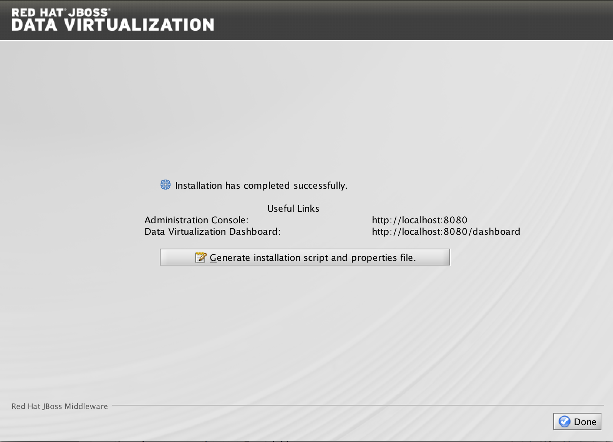 | インストールが完了します。プロパティファイルを生成することができます。「Done」で終了します。
|====

=== JDVパッチの適用
パッチをダウンロード後、JDVのパッチはコマンドラインで実施します。

----
$ java -jar /path/to/jboss-dv-6.3.1-patch.jar --server /path/of/server/to/patch/ --update jboss-dv

==== コマンド実行例 ====
$ java -jar ~/Downloads/jboss-dv-6.3.1-patch.jar --server /home/guest/JDV6.3 --update jboss-dv

==== パッチ適用時の Output ====
INFO  - Upgrade from jboss-dv-6.3.0 to jboss-dv-6.3.1
----

== JBDS のインストール
=== 全体の流れ
JBDS の インストールは以下の手順で行います

  * JBDSのインストール
  * JBDS Integration Stack のインストール
  * JDVサーバへの接続設定
 
=== JBDS のインストール
JBDS も JDV と同様に、JAR形式 でインストーラが配布されておりますので、 java -jar コマンドで GUI インストーラを起動しインストールします。

----
$ java -jar jboss-devstudio-8.1.0.GA-installer-standalone.jar
----

以下、ウィザードにしたがって操作します。

[width="75%",cols="3,2",options="header"]
|====
^.^| 画面 ^.^| 説明
| 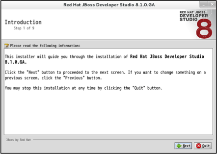 | そのまま Next をクリックします。
| image:images/JBDS8.1.0_install_002.png[] | ライセンスの確認画面です。「I accept ...」を選択すると、Nextをクリックできるようになります。
| 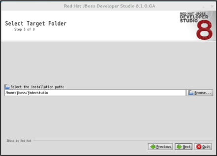 | インストールディレクトリを設定します。
| 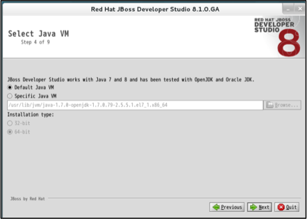 | JVM を設定します。通常はデフォルト設定で構いません。
| 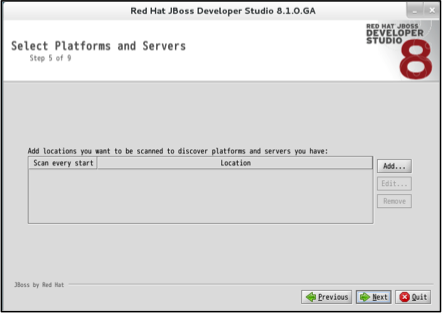 | EAP や Tomcat などの設定を行う場合には、この画面で行います。ここではそのまま「Next」をクリックします。
| 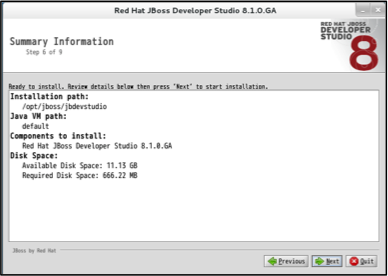 | サマリー画面です。特に問題がなければ Next をクリックします。
| image:images/JBDS8.1.0_install_007.png[] | インストールが開始されます。しばらく待ちます。インストールが終了すると、このようになります。Next をクリックして次に進めます。
| 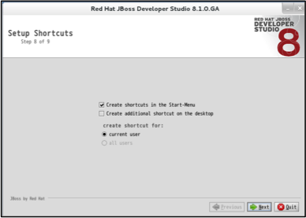 | ショートカットを作成します。
| 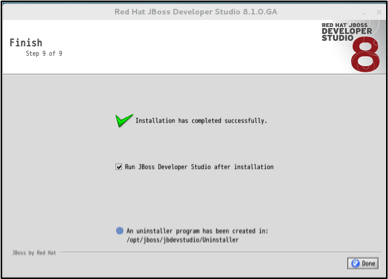 | インストールが完了しました。Done をクリックすると、インストールは完了します。「Run JBoss...」のチェックが入っていると、そのままJBDS を起動します。。
|====

なお、インストールしたJBDSは次の2通りの起動方法があります。

  * メニュー (ショートカット)からの起動
    ** インストール時に作成したショートカットから起動
	
  * コマンドラインからの起動
+
----
$ cd ${インストールディレクトリ}/jbdevstudio
$ ./jbdevstudio
----

=== JBDS Integration Stack のインストール

Red Hat JBoss Developer Studio 8.1.0 には、Red Hat JBoss Data Virtualization を開発するツールが初期状態でインストールされていません。インストールするには以下の手順を実行してください。

. JBoss Developer Studio を起動します。
+
Linux の場合は「アプリケーション」-「プログラミング」から「Red Hat JBoss Developer Studio 8.1.0.GA」を選択します。 +
Windowsの場合は「スタート」メニューから「Red Hat JBoss Developer Studio8」- 「Red Hat JBoss Developer Studio 8.1.0.GA」を起動します。

. JBDS起動後は画面より次の以下の設定を実施します。

[width="75%",cols="3,2",options="header"]
|====
^.^| 画面 ^.^| 説明
| 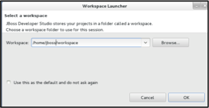 | ワークスペースのディレクトリを指定します。
| 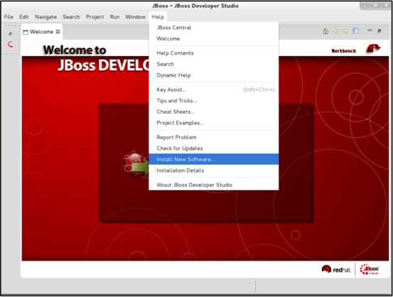 | JBDS 起動後、メニュー「Help」から「Install NewSoftware」を選択します。
| 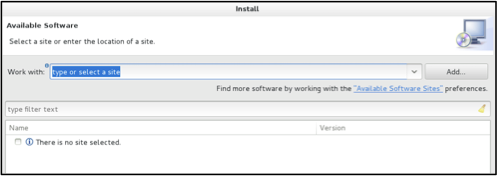 | 「Add」ボタンをクリックします。
| 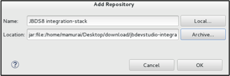 | 「Archive」ボタンをクリックし、Integration Stack のアーカイブファイルを指定します。
| 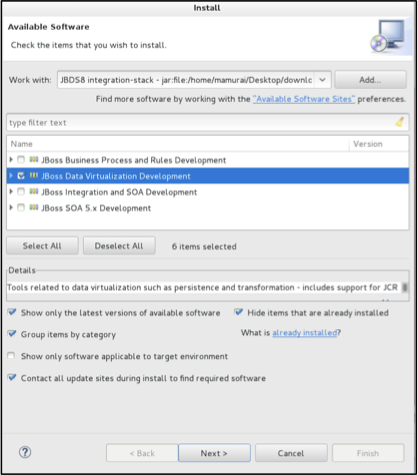 | インストール可
能なアイテム一 覧が表示されま すので「JBoss Data Virtualization Development」にチェックを入れ、「Next」をクリックします。
| 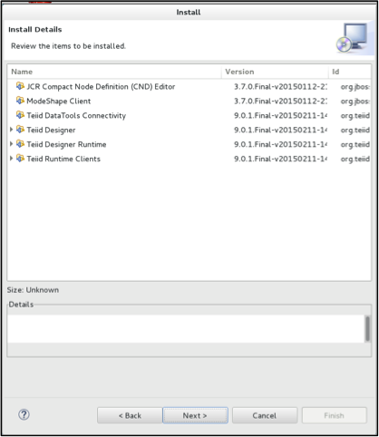 | インストール内容が表示されます。そのまま「Next」をクリックします。
| 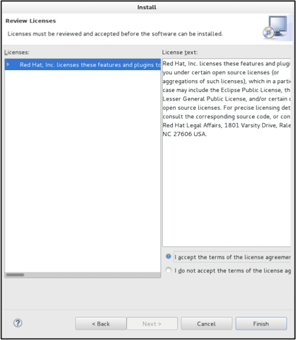 | ライセンスの確認を行います。同意して「Next」をクリックするとそのままインストールが開始されます。
| 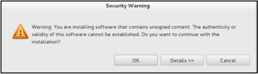 | 署名されていないコンテンツが含まれている場合には左図のようなメッセージが表示されます。
| 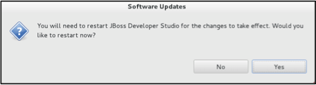 | インストール完了後、再起動を促されますので「Yes」をクリックして再起動します。
| 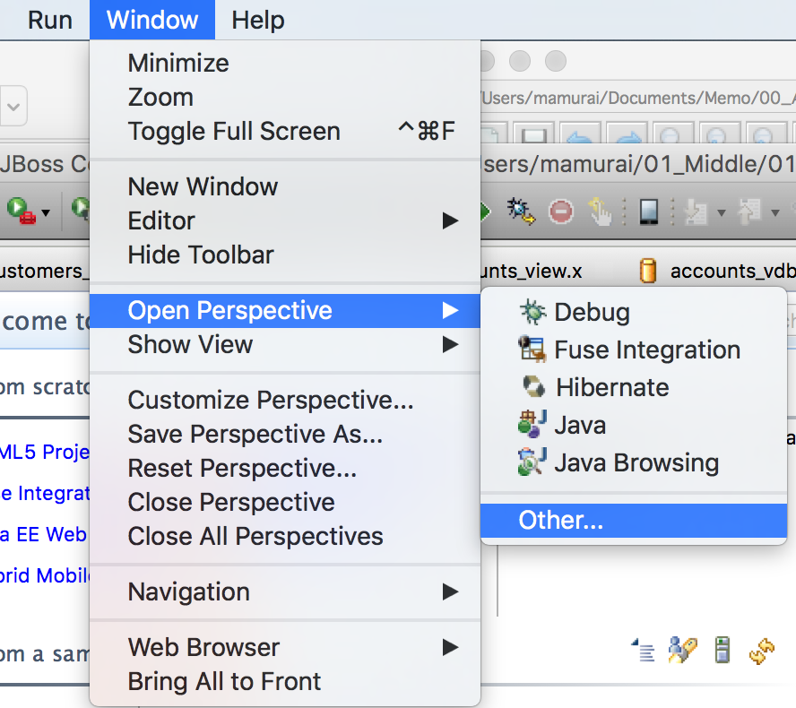 | 再起動後、「Window」メニューから「OpenPerspective」>「Other」を選択します。
| 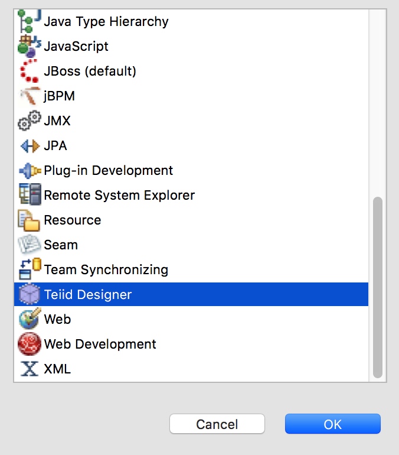 | 左図のように
「Teiid Designer」があることを確認します。選択して「OK」をクリックします。
|====

=== JDV サーバへの接続設定
インストールしたJBDSから JDVサーバに接続できるようにします。

[width="75%",cols="3,2",options="header"]
|====
^.^| 画面 ^.^| 説明
| 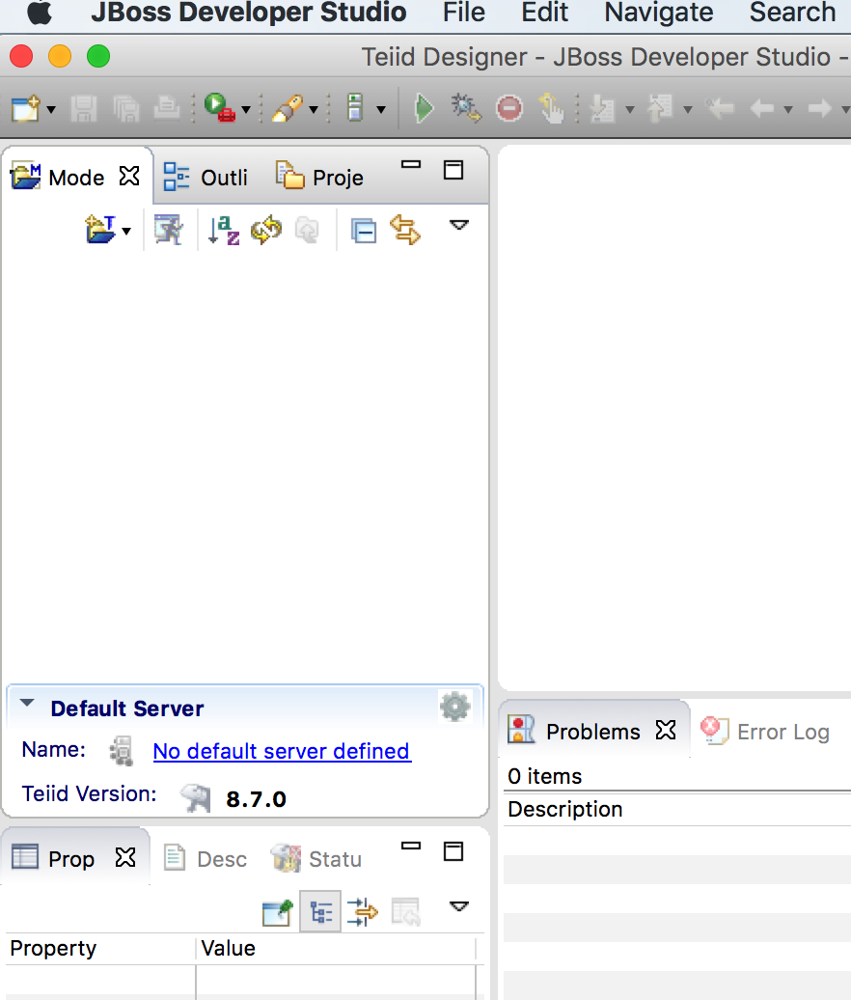 | Teiid Designer パースペクティブの中で「Model Explorer」を開きます。下に「DefaultServer」がありますので「No defaultserver defined」をクリックします。
| 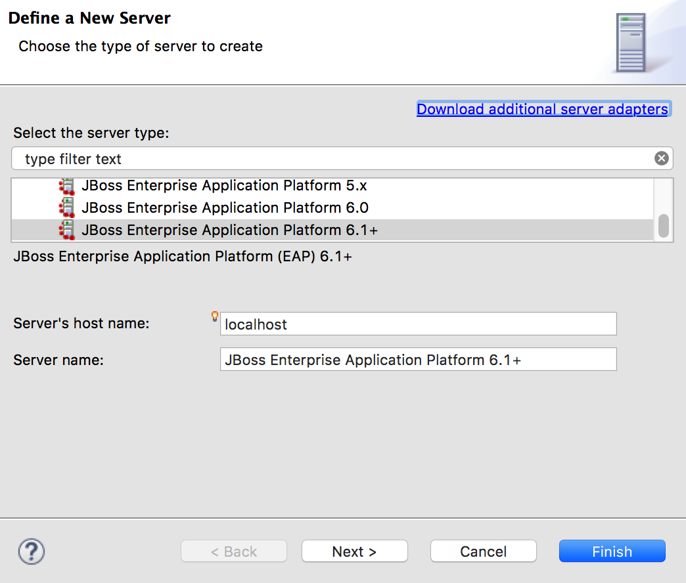 | サーバ名などを設定します。ここではそのまま「Next」をクリックします。
| 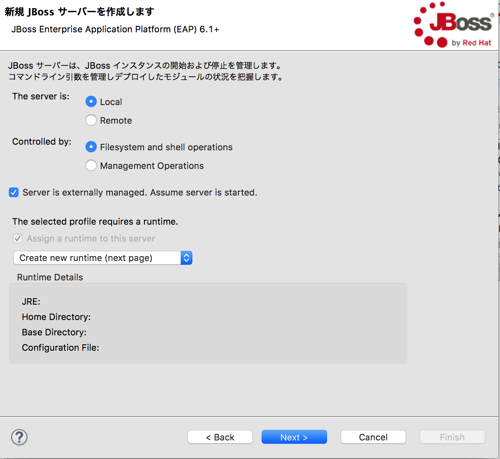 | サーバの設定を行います。「Server isexternallymanaged. Assumeserver is started」にチェックを入れます。これによってサーバの起動停止はサーバ側で行うようにします。
| 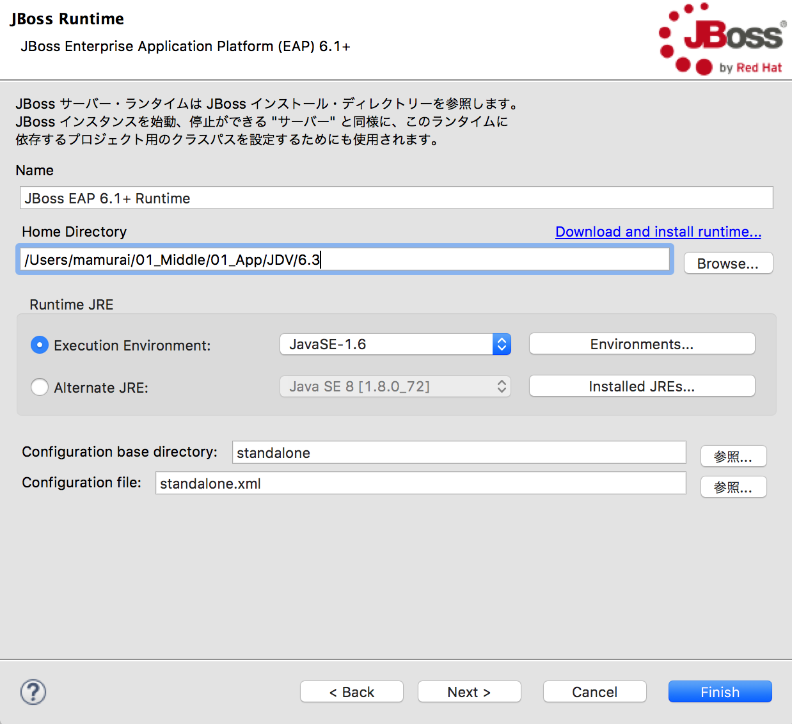 | Home Directory を設定します。「Browse」ボタンをクリックして選択ができます。EAP のインストールディレクトリを設定します。
| 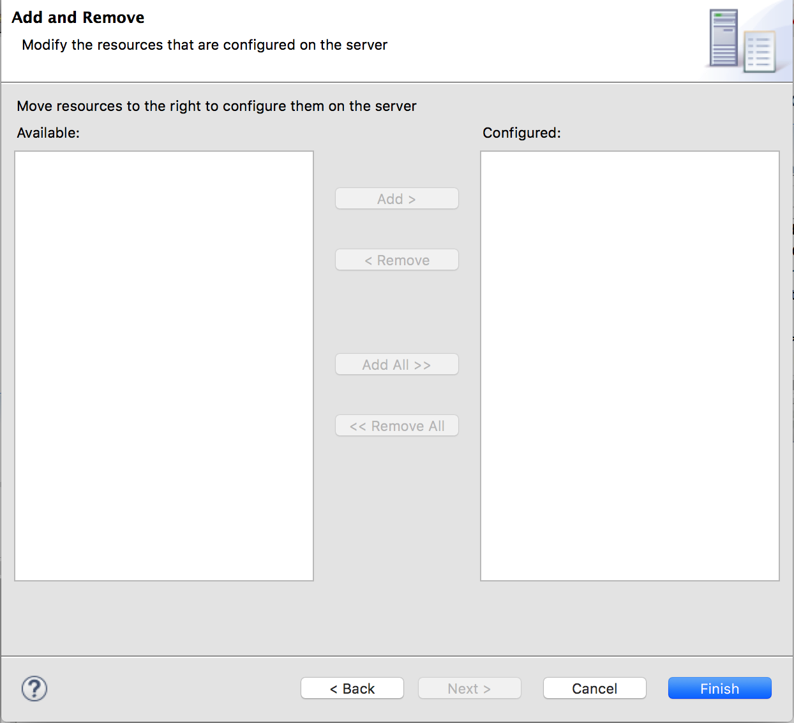 | サーバにデプロイするものはありませんのでそのまま「Finish」をクリックします。
| 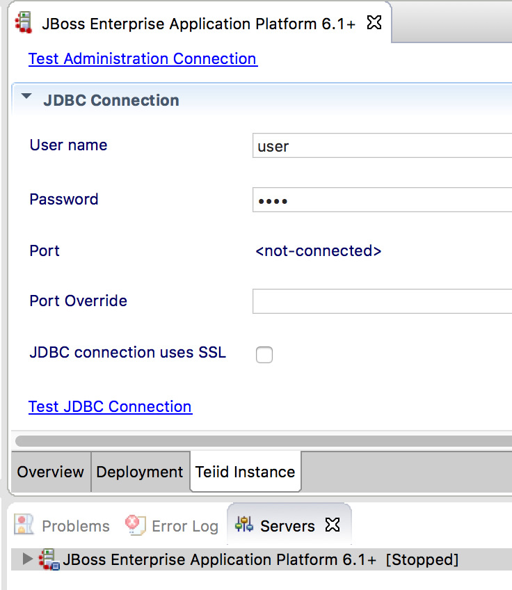 | サーバ設定後「Servers」には設定したサーバが表示されます。これをダブルクリックすると、その設定が表示されます。設定内の「TeiidInstance」にあるJDBC Connection設定はユーザ名が異なっていますのでこれを書き換えます。 +

[設定値] +
  ユーザ :  teiidUser +
  パスワード : ******** 
| 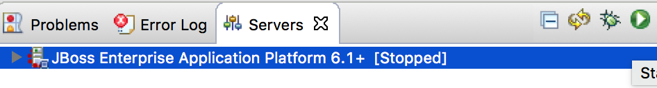 | 設定変更後「Servers」においてサーバを開始します。(緑の○に白い△)実際にはサーバは開始していますので、接続するだけです。
| 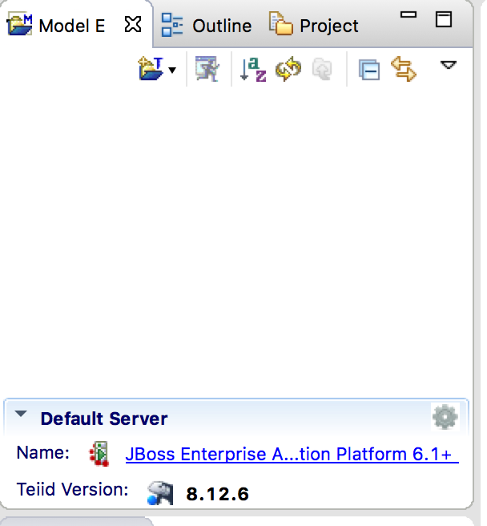 | 接続後、ModelExplorer の DefaultServer にある TeiidVersion のアイコンに青丸が付く点を確認してください。
| 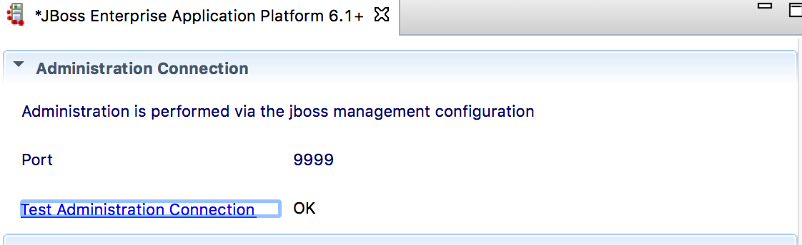 | サーバの設定画面で「TestAdministrationConnection」をクリックして「OK」が表示されればJDVサーバへの管理接続ができています。
| 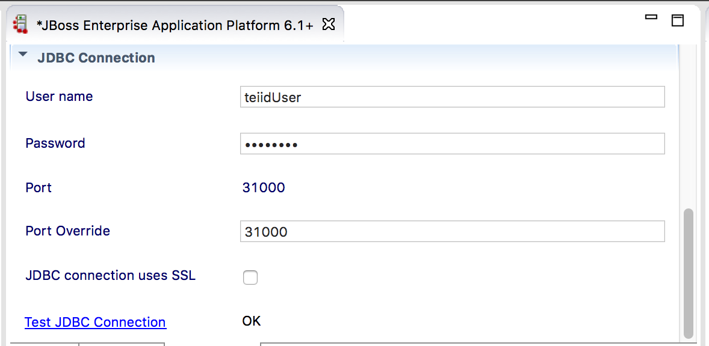 | 「Test JDBCConnection」をクリックして「OK」が表示されれば、JDV サーバに対して JDBC接続ができています。
|====

== 参考情報
=== インストールガイド
* https://access.redhat.com/documentation/en/red-hat-jboss-data-virtualization/6.3/paged/installation-guide/[JDV 6.3(英語のみ)]
* https://access.redhat.com/documentation/ja-JP/Red_Hat_JBoss_Data_Virtualization/6.2/html/Installation_Guide/index.html[JDV 6.2(日本語)]
* https://access.redhat.com/documentation/en-US/Red_Hat_JBoss_Developer_Studio/8.1/html/Install_Red_Hat_JBoss_Developer_Studio/index.html[JBDS(英語のみ)]
* https://access.redhat.com/documentation/en-US/Red_Hat_JBoss_Developer_Studio_Integration_Stack/8.0/html/Install_Red_Hat_JBoss_Developer_Studio_Integration_Stack/index.html[JBDS Integration Stack(英語のみ)]