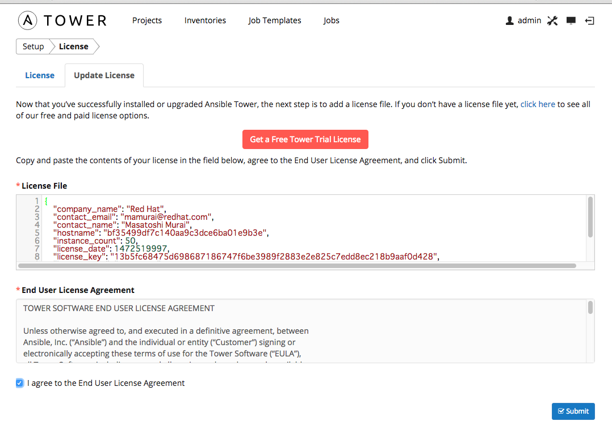

= ansible-tower 導入メモ

== 参考URL
  * https://store.ansible.com/redhat/tower_license/[Tower Trial for Red Hat]
  * http://docs.ansible.com/ansible-tower/index.html[User Guide]
  * http://docs.ansible.com/ansible-tower/latest/html/towerapi/index.html[API Guide]

== 事前準備

=== kvm 環境の準備

  * kvm clone

  # virt-clone --original rhel7_min --name ansible --file /var/lib/libvirt/images/ansible.qcow2
  # virsh start ansible

  * コンソール接続し次の設定を変更する

    # virsh console ansible

    ** ホスト名変更

      # nmcli general hostname ansible.osaka.redhat.com

    ** ipアドレス変更

      # vi /etc/sysconfig/network-scripts/ifcfg-ens3
      ==========================
      TYPE="Ethernet"
      BOOTPROTO="static"
      IPADDR=192.168.99.89
      NETMASK=255.255.255.0
      NETWORK=192.168.99.0
      GATEWAY=192.168.99.1
      BROADCAST=192.168.99.255
      DNS1=192.168.99.51
      DNS2=8.8.8.8
      DEFROUTE="yes"
      IPV4_FAILURE_FATAL="no"
      IPV6INIT="no"
      NAME="ens3"
      UUID="eb27c5d9-a128-4423-98ca-26458ec1de0b"
      DEVICE="ens3"
      ONBOOT="yes"
      PEERDNS="yes"
      PEERROUTES="yes"
      ==========================
      # systemctl restart network

    ** サブスクリプション登録

    # subscription-manager register --username=<user_name> --password=<password>

    ** Pool Id の紐付け

    # subscription-manager attach --pool=<pool_id>
    # subscription-manager attach --pool 8a85f98144844aff014488d058bf15be

  	** Yumリポジトリのサブスクライブ

    # subscription-manager repos --disable="*"
    # subscription-manager repos \
        --enable="rhel-7-server-rpms"

    ** yum update 実行

    # yum -y update
    # init 0

    ** スナップショットの取得 (Guest OS 停止後 kvm host側で実行)

    # virsh snapshot-create-as ansible sn_init_ansible

=== DNSの登録
ansible-tower を利用する際はDNSの名前解決が必。今回は次の名称とアドレスを付与

  192.168.99.89 ansible.osaka.redhat.com

=== ansible tower ダウンロード と LICENSE KEY の取得

https://store.ansible.com/redhat/tower_license/[TOWER TRIAL FOR RED HAT]ページより取得する。
Red Hat Employee は申請すればライセンスを取得できます。

=== ansible tower インストール

* ファイルを ansibleファイルをサーバ上に配置
* 設定ウィザードを起動しAnsible Towerの設定を実施
----
[root@ansible ansible-tower-setup-2.4.5]# ./configure
-------------------------------------------
Welcome to the Ansible Tower Install Wizard
-------------------------------------------

This wizard will guide you through the setup process.

PRIMARY TOWER MACHINE
Tower can be installed (or upgraded) on this machine, or onto a remote machine
that is reachable by SSH.

Note: If using the High Availability features of Tower, you must use DNS
resolvable hostnames or IP addresses (do not use "localhost").

Enter the hostname or IP to configure Ansible Tower
(default: localhost):
Installing Tower on localhost.

DATABASE
Tower can use an internal database installed on the Tower machine, or an
external PostgreSQL database. An external database could be a hosted database,
such as Amazon's RDS.

An internal database is fine for most situations. However, to use the High
Availability features of Tower, an external database is required.

If using an external database, the database (but not the necessary tables) must
already exist.

Will this installation use an (i)nternal or (e)xternal database? i

PASSWORDS
For security reasons, since this is a new install, you must specify the
following application passwords.

Enter the desired Ansible Tower admin user password:
Enter the desired Munin password:

REVIEW
You selected the following options:

The primary Tower machine is: localhost
Tower will operate on an INTERNAL database.

Are these settings correct (y/n)? y
Settings saved to /root/ansible-tower-setup-2.4.5/tower_setup_conf.yml.

FINISHED!
You have completed the setup wizard. You may execute the installation of
Ansible Tower by issuing the following command:

sudo ./setup.sh
----

* Ansible Towerのインストール

[root@ansible ansible-tower-setup-2.4.5]# ./setup.sh

* ブラウザーから管理画面にアクセス。LICENSE KEY を設定する

