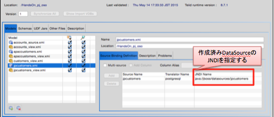
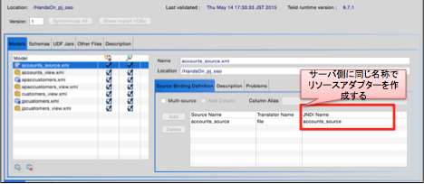

# OpenShift Online で　JDV6.0 HandsOn環境構築手順

##前提
* OpenShift Online のアカウント取得 (NameSpade mamurai)
* OpenShift Client Tool のインストール  
* クライアントPCにJBossEAPのライブラリーがインストール済み
* Modeling > Preview Data を実施するには　PREVIEW用データソースの設定が必要。ファイルのプレビュー方法は不明

##OpenShift上にアプリケーションを作成
1. jdv6.1.0カートリッジを利用する app dv61 を作成  

		$ rhc app create dv61 jboss-dv-6.1.0

2. PostgreSQL カートリッジの追加  

		$ rhc cartridge add postgresql-9.2  --namespace mamurai --app dv61

3. カートリッジ状況確認  
1) postgresqlカートリッジ  

		$ rhc cartridge show postgres --namespace mamurai --app dv61
2) JDV6.1.0カートリッジ  

		$ rhc cartridge show jboss-dv-6.1.0 --namespace mamurai --app dv61

4. port-forward 開始  

		$ rhc port-forward dv61

Port Foward実施時のOutput:

	Checking available ports ... done
	Forwarding ports ...
	Address already in use - bind(2) while forwarding port 5432. Trying local port 5433

	To connect to a service running on OpenShift, use the Local address

	Service    Local                OpenShift
	---------- --------------- ---- -----------------
	java       127.0.0.1:31000  =>  127.5.182.1:31000
	java       127.0.0.1:3528   =>  127.5.182.1:3528
	java       127.0.0.1:35432  =>  127.5.182.1:35432
	java       127.0.0.1:4447   =>  127.5.182.1:4447
	java       127.0.0.1:5445   =>  127.5.182.1:5445
	java       127.0.0.1:8080   =>  127.5.182.1:8080
	java       127.0.0.1:9990   =>  127.5.182.1:9990
	java       127.0.0.1:9999   =>  127.5.182.1:9999
	postgresql 127.0.0.1:5433   =>  127.5.182.2:5432

	Press CTRL-C to terminate port forwarding

### JBDSからJDVへの接続
port fowardの設定がされているため、クライアントPCからJDVに接続するには、localhost:31000に接続すれば良い。  
なお、JBossEAP管理者画面へのアクセスはデフォルトではパスワードが設定されていない。

### HandsOn DBデータの登録 (OpenShift上のPostgreSQLへデータ登録)
1. PostgreSQLへのログインしデータ登録SQLを実行　(ID/Password)取得は「アプリケーションの作成 3.1)」参照  

		$ psql -U <$ID> -h localhost -p5433 dv61
		Password for user adminpp9elvl: <$Password>
		
		dv61=# \i <$コンテンツ格納PATH>/JDV6Handson/JDV_HandsOn_postgresql.sql 
	

### DataSourceの作成 (接続先は OpenShift上から参照可能なDBのIP:Portを指定する)
1. OpenShift上のJBossEAPの管理CLIへ接続しDataSourceを作成する  
1) 管理CLIへの接続

		$ <$JBOSS_HOME>/bin/jboss-cli.sh -c --controller localhost:9999
2) JDBCドライバーの登録

		[standalone@localhost:9999 /] deploy <$コンテンツ格納PATH>/JDV6Handson/postgresql-9.2-1004.jdbc4.jar 
3) データソースの作成
		
		[standalone@localhost:9999 /] data-source add --name=jpcustomers --connection-url=jdbc:postgresql://127.5.182.2:5432/jpcustomers --jndi-name=java:/jboss/datasources/jpcustomers --driver-name=postgresql-9.2-1004.jdbc4.jar --user-name=jpcustomers --password=jpcustomers
		[standalone@localhost:9999 /] data-source enable --name=jpcustomers
		[standalone@localhost:9999 /] data-source add --name=apaccustomers --connection-url=jdbc:postgresql://127.5.182.2:5432/apaccustomers --jndi-name=java:/jboss/datasources/apaccustomers --driver-name=postgresql-9.2-1004.jdbc4.jar --user-name=apaccustomers --password=apaccustomers
		[standalone@localhost:9999 /] data-source enable --name=apaccustomers


### ファイルリソースアダプターの登録　(ファイルをデータソースとして利用する場合)
1. SSHで接続しCSVファイル格納用ディレクトリを作成

		$ rhc ssh dv61
		[dv61-mamurai.rhcloud.com 55516d95e0b8cd4a31000117]\> cd dv
		[dv61-mamurai.rhcloud.com dv]\> mkdir csv
		[dv61-mamurai.rhcloud.com dv]\> exit

2. CSVファイルをSCP　(接続先は 「$ rhc apps」 コマンドで確認する)

		$ scp <$コンテンツ格納PATH>/JDV6Handson/accounts.csv 55516d95e0b8cd4a31000117@dv61-mamurai.rhcloud.com:./dv/csv

3. ファイル リソースアダプターの作成  
1) 管理CLIへの接続

		$ <$JBOSS_HOME>/bin/jboss-cli.sh -c --controller localhost:9999
2) ファイルリソースアダプターの作成、JDV再起動

		[standalone@localhost:9999 /]  cd /subsystem=resource-adapters/resource-adapter=file
		[standalone@localhost:9999 /]   ./connection-definitions=accounts_source:add(jndi-name=java:/accounts_source, class-name=org.teiid.resource.adapter.file.FileManagedConnectionFactory, enabled=true, use-java-context=true)
		[standalone@localhost:9999 /]   cd connection-definitions=accounts_source
		[standalone@localhost:9999 /]   ./config-properties=ParentDirectory:add(value="/var/lib/openshift/55516d95e0b8cd4a31000117/dv/csv")
		[standalone@localhost:9999 /]  /:shutdown(restart=true)

### ハンズオン トレーニング・ラボ資料 〜基本編〜 の実施
OpenShift上のJDVに対して SSH Port Forward でセッションを張り、ローカル環境のように利用できるが、
データのPreview実行時には、PREVIEW DataSource の設定変更が必要となる。  
CSVファイル等をデータソースとしている場合は、リソースアダプターの設定が必要となる。  
**但し、Data PREVIEWでの参照方法は現時点で不明**

 
### VDB作成時の注意点
VDBに含まれる物理モデルについては、VDB作成時にJNDIを上記の「DataSourceの作成」で作成したデータソースに変更する必要がある。



ファイルを参照する場合は、「ファイルリソースアダプターの登録」の通り、事前に同じ名称でリソースアダプターを作成し、該当ディレクトリにファイルを配置しておく必要がある。


###　カートリッジの起動/停止/確認
	$ rhc cartridge [start|stop|show] jboss-dv --naespace mamurai --app dv61
	$ rhc cartridge [start|stop|show] jboss-dv -n mamurai -a dv61